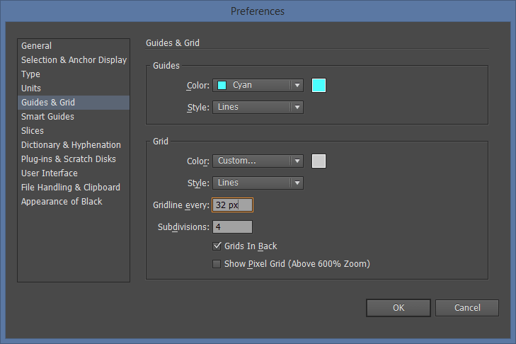

# BitIcons
If you want to make pixel icons for your website, but don’t want to use generic icons that everyone else is using and you don’t know where to start? **You are in the right spot!**

I am going to explain step by step basics of the whole design process and implementation of your new custom icons to your website. The tutorial will cover these areas:

**1. For Designers**
- Introduction to pixel perfect icon design
- Design process in Adobe Illustrator
- Exporting icons as SVG

**2. For Frontend developers**  
- Publishing your icons as web fonts
- File revving
- Using Biticons web fonts

**3. Benefits of using this program**

## For Designers
Design of pixel-perfect icons in a vector drawing program like Adobe Illustrator can be quite confusing if you haven't done this before. Most of the tutorials on the web are explaining to you how to draw in 1:1 resolutions, but to be honest - if you are using vectors, there is no need for that. Moreover, it is much better to use the process I will describe here.

### Introduction to Pixel Perfect Icon Design
Designing pixel perfect font icons is the process where you draw vector graphics and then scale it down to desired font size so that all straight lines aren’t displayed with antialiasing. This is important because you want your icons as clear as they can be and you don’t want site visitors to guess what you had in mind when you designed them.

As icon becomes smaller, the importance of pixel-perfect design becomes more significant because if you don't make them properly, they will appear smudged. We don't want that.

Another important factor is screen density. At the time when I am writing this tutorial, monitors with 72-96 dpi are still dominant in the world and we want to design something that everyone can understand. Even when 150+ dpi monitors (4K and larger) become a dominant world standard, you will be able to use ideas presented in this tutorial to design clear and understandable icons.

#### Real Life Example
In the image below, you can see how good and bad icons look in their real size, magnified 4x from a screenshot and in real life on a regular monitor.

There will always be some minor antialiasing on the edges when vector objects are shown on the screen, but we want to bring that down to a minimum.

### Design Process In Adobe Illustrator
Before we start to design new icons, we need to figure out their use case – will we use them aligned with regular paragraph text, which has its own set font size, or will we use them in some special cases like in buttons, headlines or perhaps on their own as larger graphics?

As I wrote earlier - as icon becomes smaller, the importance for pixel perfect design becomes more important.

#### Case 1 – 16px Font Size
This is the most common case since most browsers set 16px as their default font size for paragraph text. Since Adobe Illustrator is a program for vector drawing, we don’t need to design icons in 1 to 1 ratio, zoomed into the max :) Our artboard will be much larger.

Here is the math for default artboard:

    16^2 x 2 = 512 height

The height of 512 is minimum artboard size that we will use. The unit is not important in Illustrator since it is vector drawing program. You can choose whatever you want – pixels, centimeters, points. I will just write it as “unit” when used in vector drawing program.

For this example, we will make an icon on a square art board of 512 x 512 units.

Next step is setting up our grid. We want each grid column to be 1px in a finished icon.

    512 units height / 16px font size = 32 units grid

Subdivisions are there for better precision and one special usage that I will explain later.

This is the final art board that we will use for our 16px icons.

**PLEASE NOTE:** We will need to recalculate artboard and grid sizes for all different icons sizes.

We can now design icons! :) In this example, I have prepared the test pattern.

Each line has a width of 32px, which will translate to 1px in 16px icon. Don't be limited by straight lines, you can use curves as well, but in that case, use line stroke that is the same width as the grid. In this case also 32px.

##### How Can We Use "Flaws" In Antialiasing For Our Advantage?
Simple - we can use thinner lines as well, but the effect is quite different. The line that is 50% thinner than grid width will produce an effect of 50% transparency in its place. That is a nice side effect of antialiasing which we can use for increased creativity, some interesting patterns and simulated transparency.

This effect is noticeable on screens with 72/96dpi. On high DPI screens, this effect will not be as noticeable.  

#### Case 2 – Non-Standard Icon Size
We don't need to create pixel perfect icons that are limited to 16px. We can make any pixel perfect sizes we want and this is how we do it.  

Same as before, we need to recalculate artboard and grid size so that they can be aligned to new pixel size.

For instance, if our new icon is 24px, art board size would be:

    24^2 x 2 = 1152

New grid size would be:

    1152 / 24 = 48

Simple. Please note that artboard has to be larger than 512px because we want to maintain fine details in the final result.

#### Case 3 – Wide Icons
It is not a problem to create icons that are much wider than square artboard. Just extend the width of an artboard, but keep the height the same. Like this one (16px tall icon).

### Exporting As SVG
When your design is finished, there are few rules you must follow before you export your icon as SVG:

- Only vectors are included, all raster graphics are discarded. Don’t use raster images!
- Only flat surfaces are included. All strokes must be converted to fills, use Object -> Expand command.
- Only one color is accepted. If you plan to make hollow objects, use Pathfinder -> Exclude command.
- All fonts must be created as outlines

When you finish all those tasks, save a file as SVG and your icon is ready to be included in your new icon font.

If you are only designing icons, you can stop reading here. The part that follows is intended for frontend engineers that will use your SVG as Web fonts in their code. If you want to keep on reading, please do - it's really easy to do all of this even if you are not a developer. I am also a designer ;)

---

### Publishing Your Icons As Web Fonts
BitIcons project is split into two main folders - `src` and `dist`.

Steps for creating icons:

- Copy all prepared SVG files that you have created into `src/biticons/svg`
- Start a gulp build process `gulp` command.
- If you installed everything correctly, your new font is now created and copied to `dist` folder

For your convenience, every time you create new icons, Style Guide will be created as well. Style guide is located in `dist/biticons/index.html`

### File Revving
This font building pack can use font revving, which means that it will add different font version for each build. **Apache server** will be able to read and refresh fonts every time they are rebuilt without a user needing to reload a page or empty browser cache, so keep in mind that `.htaccess` file and copy it on your server together with your new fonts.

File revving setting is located in `/gulp/tasks/biticons.js`

    var fontName = 'biticons',
        fileRevving = true,                     // Turn off on nginx servers
        fontVersion = Math.floor(Date.now());   // Timestamp in miliseconds

If you are using some other server, be sure to keep file revving disabled fith `false` or to modifiy your server settings.

### Using Biticons web fonts
Copy finished `biticons` folder to your site and include it your `<head></head>` area.  

    <head>
      ...
      <link rel="stylesheet" href="biticons/biticons.css" />
      ...
    </head>

For your coding convenience, you can extend icon classes from `src/biticons/generated/_biticons-glyphs.scss`.

## Benefits of using this program
So what are the benefits?
- **You have full control** over what icons you would like to use in your project. You don't have to force users to download every single icon from some font pack like Font Awesome. Pick what you like and use it.
- **It's fast**. After you copy SVG's to project folder, it takes only a few seconds to build entire web font
- **It's smaller in size** than other solutions. For instance, I have used really great [IcoMoon website](https://icomoon.io/app/#/select) to generate icon fonts before, but with this solution, with same icons, final font files are much smaller.

---

## Author
Vladimir Jovanović
